# 背了吗 —— 你的 AI 知识速记卡片

> 把琐碎的知识点整理成小卡片，让你在通勤、排队等各种碎片化场景都能随时随地大小背，堪称八股界的「不背单词」。

「背了吗」是一款 **AI 驱动的通用知识速记工具**。它把零散的知识点做成可翻转的闪卡，配合 **SM-2 间隔重复算法**智能安排复习节奏，帮你把"看过就忘"变成"真正记住"。

**你的任何资料都能一键变成题库**——上传 `md / Word / PDF`，AI 自动拆成记忆卡片。不管是 LLM / Agent 面试八股、考研专业课、要考的证书，还是想背下来的笔记，都能用它随时随地背。

---

今天，你「背了吗」？

是不是总有一堆想记住的东西：考研的专业课、要考的证书、面试八股文……

收藏了、下载了、整理了，划了一堆重点，却一直拖着没真正记住？

有了「背了吗」，任何资料都能变成随身闪记卡。上传一份 `md / Word / PDF`，AI 自动帮你拆成一张张记忆卡片，不用手动录入。每天通勤、排队、等车时，拿出来刷一刷，当天该学的、该复习的，立马轻松完成。

它可以帮助你：

1. **上传任意文档**（`md / docx / pdf`），AI 自动生成专属题库，不用一张张手打。
2. 把碎片时间用起来，**想背什么就建什么库**，随心切换。
3. 用 **SM-2 间隔重复算法**，在你快要忘记时刚好推送复习，科学记忆，直到形成"肌肉记忆"。
4. **可视化学习数据**，按题库分门别类，让日积月累的成果被"看见"。
5. 内置 **AI 小助手**，随时答疑解惑、举一反三。

你想记住的一切，都能变成随身携带的记忆卡片。下次考试、面试、或只是想检验自己前，先问一句：**今天，你「背了吗」？**

## 亮点

- **上传文档，一键成库**：上传本地 `md / Word / PDF`，AI 自动解析并拆成一张张记忆卡片，无需手动录题——你自己的讲义、笔记、八股，都能秒变随身题库。
- **多题库自由管理**：内置「AI 面试题库」+ 无限自建题库，支持重命名、增量更新、删除；可按题库浏览、筛选、统计，还能在首页指定「今天只学哪个题库」。
- **聚焦 AI 面试**：内置 Agent 开发高频面试题，覆盖 LLM、Prompt、工具调用、记忆、规划等核心考点，开箱即用。
- **碎片化学习**：卡片式交互，通勤、排队随时来几张，学习无压力。
- **科学复习**：基于 SM-2 间隔重复算法，按你的掌握程度自动决定"什么时候再看这道题"。
- **复习优先机制**：当天有到期复习题时先复习再学新题，避免知识欠账越滚越多。
- **进度可视化**：学习时长、连击天数、分题库掌握进度、成就体系与学习日历，一目了然，正反馈拉满。
- **AI 学习助手**：翻卡看答案时可唤起「兔叽咪」，基于当前题目与标准答案答疑、举例、拓展考点，流式输出 + Markdown 渲染。
- **多端同步 & 离线兜底**：登录后学习进度、自建题库云端同步，多设备接力；未登录 / 离线以 localStorage 兜底，数据不丢。
- **极致轻量**：纯前端 + BaaS，无重型依赖，图片资源经 WebP 压缩约 98% 并内联，切页/刷新不重复请求。

## 功能演示

### 主页 —— 复习与今日学习入口

<div align="center">
  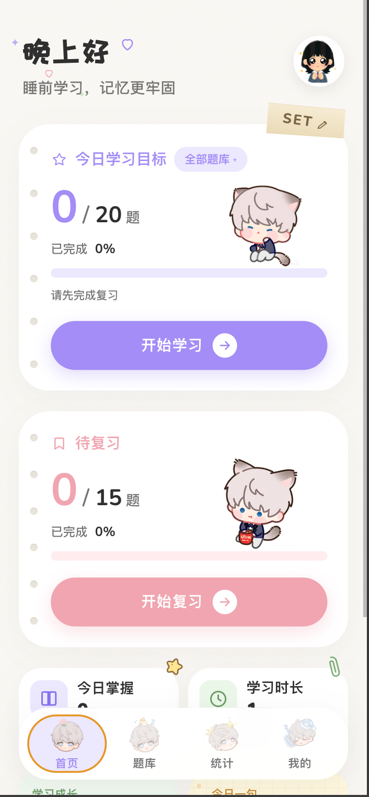
</div>

App 首页。汇总今日的待复习题目与学习目标，点击即可开始复习或学习。到期复习题优先解锁，学完才能继续攻新题；还能在这里选择「今天想学哪个题库」。

### 学习流程 —— 翻卡、评分、随学随问

<div align="center">
  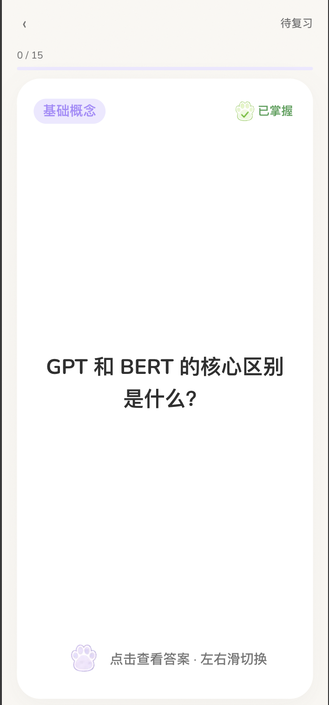
  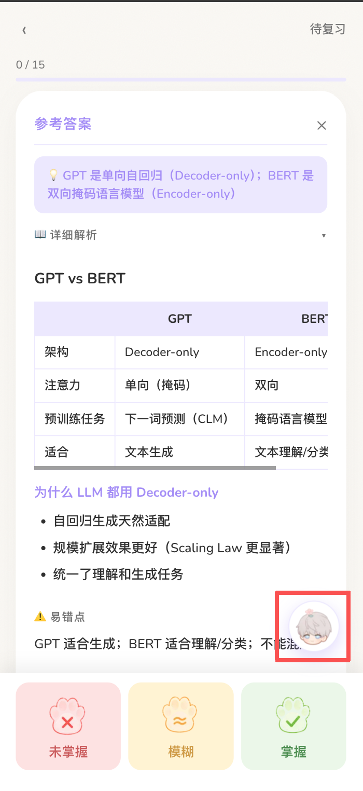
  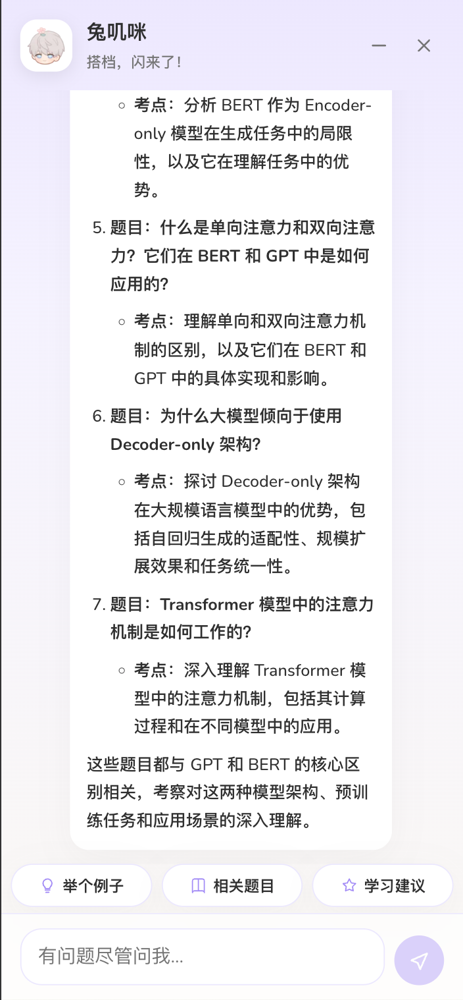
</div>

卡片正面展示题目（支持图文，左图），点击翻到答案面（中图）可快速查看完整解析——关键词、易错点、面试追问，并选择自己对这道题的掌握程度（未掌握 / 模糊 / 已掌握），系统据此安排下次复习时间。点击答案页右下角图标，即可唤起 AI 助手「兔叽咪」（右图）：它自动读取当前题目与标准答案作为上下文，围绕本题举例、拓展考点、给出记忆建议，也支持自由追问；回答流式输出、Markdown 渲染（含代码高亮），断流可一键「重新生成」。

---

### 上传文档，AI 自动生成题库 ✨

> 「背了吗」不止内置题库——你自己的任何资料都能一键变成学习卡片。

<div align="center">
  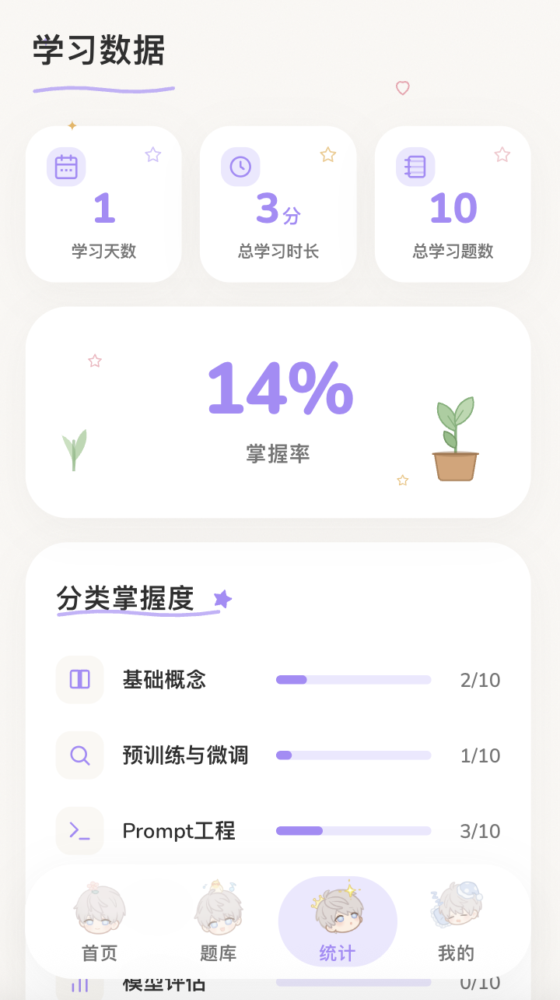
  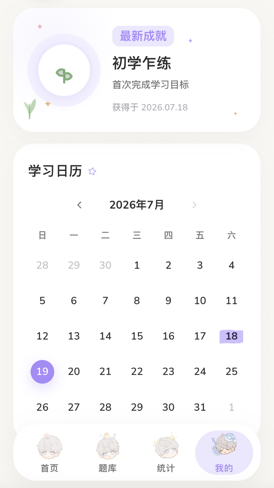
  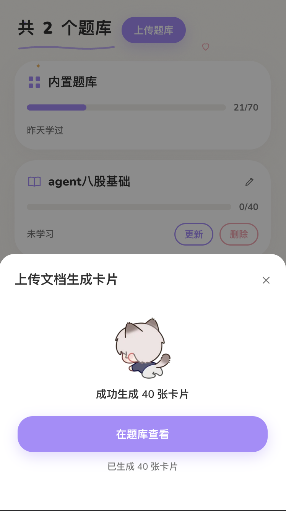
</div>

在题库页上传本地文档（`md / Word / PDF`），AI 自动解析内容并拆成一张张记忆卡片，无需手动录题。生成过程实时展示进度，逐段解析、支持随时取消，不必干等。生成成功后提示卡片数量，可进入题库查看这批新卡片。

### 题库管理 —— 自建、命名、随心组织

<div align="center">
  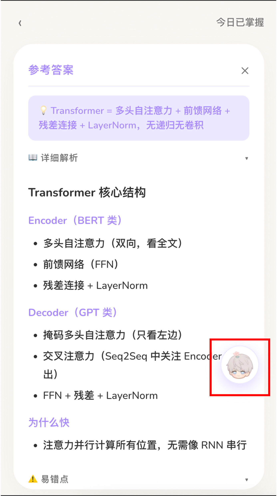
  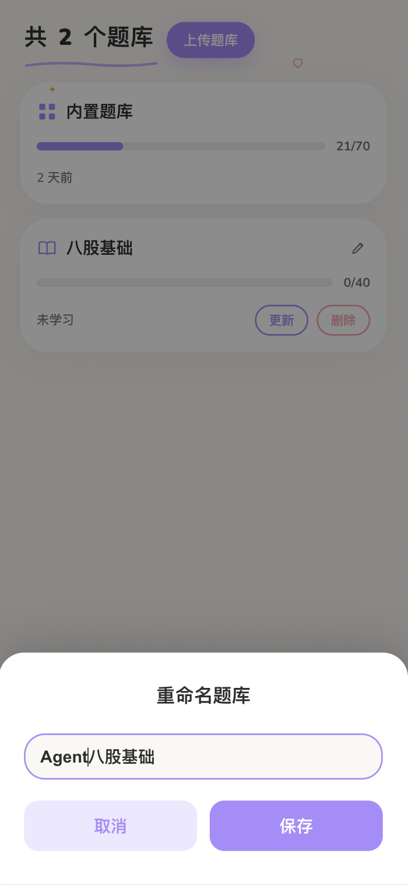
  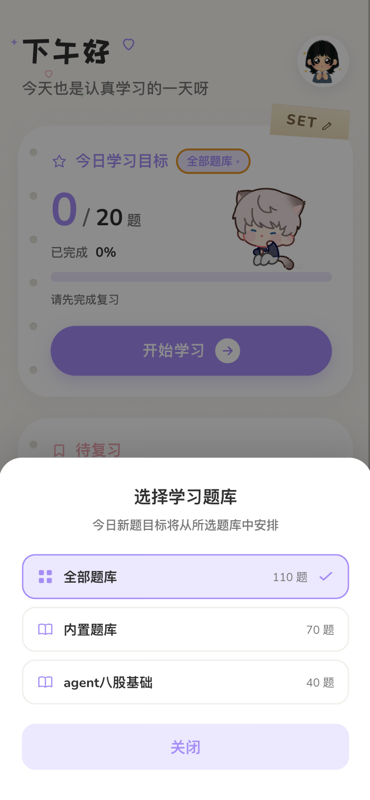
</div>

题库页按题库分组展示：内置「AI 面试题库」+ 你上传的每一个题库并列呈现，每个题库直观显示学习进度与上次学习时间，点击进入该题库的题目列表。上传的题库可随时重命名，也支持增量更新与删除，方便长期维护自己的知识库。还能在首页指定「今天想学习哪个题库」，让每日学习目标只从选定题库中安排，专注攻克某个方向。

---

### 统计 —— 学习情况 & 分题库掌握度

<div align="center">
  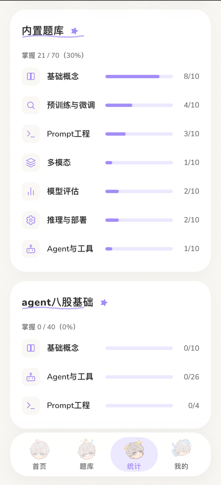
</div>

统计你的学习全貌：累计学习时长、连续学习天数、总学习题数，并**按题库分区展示各自的掌握程度**——每个题库学到什么程度，一目了然，互不干扰。

### 个人主页 & 成就 —— 让坚持被看见

<div align="center">
  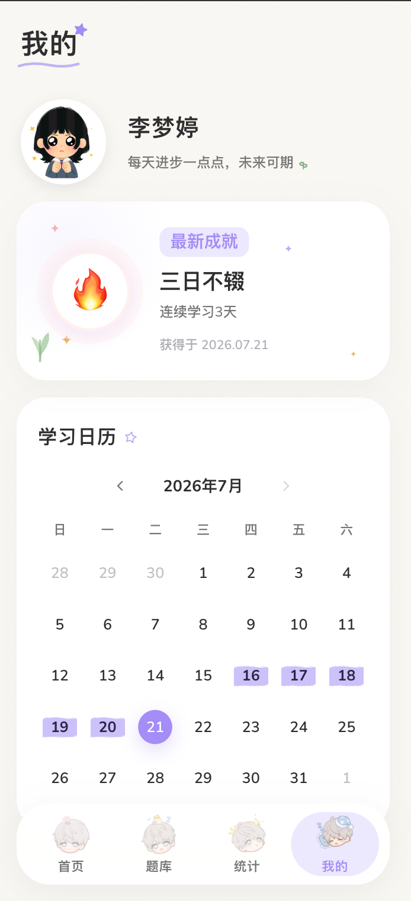
  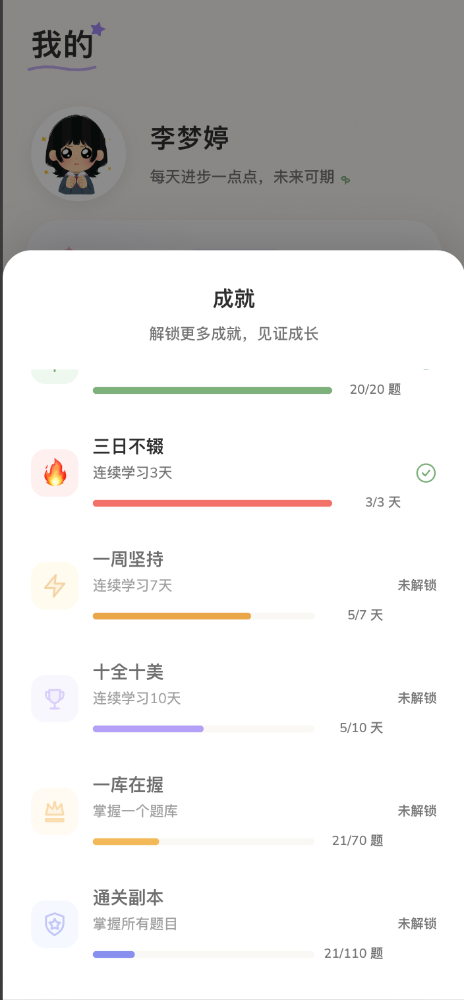
</div>

个人主页展示学习信息、已获成就与学习日历，坚持了多少天、哪天学过都看得见；成就列表汇总连续学习、掌握题库等里程碑徽章，达成即点亮，正反馈拉满。


## 技术栈

| 分类 | 选型 |
|---|---|
| 构建工具 | Vite 8 |
| 框架 | React 19 |
| 语言 | TypeScript 6 |
| 状态管理 | React Context + useReducer（无第三方状态库） |
| 样式 | 原生 CSS（CSS 变量体系） |
| Markdown 渲染 | marked + highlight.js（答案富文本 + 代码高亮） |
| AI 助手 | Kimi (Moonshot) OpenAI 兼容协议 · SSE 流式输出 |
| 复习算法 | SM-2 间隔重复算法（自实现） |
| 后端 | 小红书内部 Builder 平台（BaaS：OAuth 认证 + Supabase 数据库） |
| 数据持久化 | 云端同步 + localStorage 本地兜底 |
| 代码检查 | oxlint |


## 快速开始

```bash
npm install      # 安装依赖
npm run dev      # 本地开发
npm run build    # 构建 + TypeScript 检查
npm run preview  # 预览生产构建
npm run lint     # oxlint 静态检查
```

## 目录结构

```
src/
├── App.tsx            # 主入口：认证流程、页面切换、学习队列构建、目标管理
├── App.css            # 全部样式（CSS 变量体系）
├── store.tsx          # 全局状态、SM-2 算法、localStorage 持久化
├── api.ts             # Builder API 请求封装（认证、题目加载、云端同步）
├── types.ts           # 类型定义与常量
├── utils/             # 工具函数（分类图标映射、Kimi AI 封装 kimi.ts 等）
└── components/
    ├── HomePage.tsx       # 主页（学习 / 复习入口）
    ├── LearnPage.tsx      # 学习页（翻卡、评分）
    ├── LibraryPage.tsx    # 题库（浏览、筛选）
    ├── StatsPage.tsx      # 统计页
    ├── MePage.tsx         # 个人主页（成就）
    ├── GoalPicker.tsx     # 每日目标选择
    ├── icons.tsx          # SVG 图标 / 插画（图片组件 fallback）
    ├── learn/AIChatBot.tsx  # AI 学习助手（流式对话、上下文注入、重新生成）
    ├── home/  library/  learn/   # 各页子组件
```

## 核心机制

### SM-2 间隔重复

每张卡片记录 `status`（0 未掌握 / 1 模糊 / 2 已掌握 / null 未学习）、`interval`、
`easeFactor`、`nextReview` 等字段。评分后按算法推算下次复习时间——记得越牢，
间隔越长；答错则缩短间隔，直到真正掌握。

### 复习优先队列

首页判断 `canStartNew = reviewTotal === 0 || reviewDone >= reviewTotal`：
当天到期复习题未清空前不解锁新题，保证旧知识先巩固。复习分母采用当天首次访问的
ID 快照，避免评分后 `nextReview` 推移导致进度抖动。

### 云端 + 本地双持久化

登录后学习进度写入 Builder 数据库；未登录或离线时以 localStorage
（key `beile_ma_v3`）兜底，保证数据不丢。

### AI 助手上下文治理

整个学习队列共享一份对话，退出即销毁。为兼顾"记得住"与"不串题"，采用分层消息结构：
固定 System Prompt（身份 + 防幻觉约束）、切卡时以隐藏消息注入当前题目背景（写入即固化、界面不显示）、
严格时间序的对话历史；发送前按 token 预算做滑动窗口截断（保护 System 与题目背景）。
流式输出经三道防线保证完整性（字节重组、事件切分、`[DONE]` 校验），断流保留已生成内容并支持重新生成。

> 完整设计与踩坑记录见 `robot.md`。

## 性能优化：图片资源

`src/assets/` 原有大量 PNG 插画/图标（合计约 5.8MB，单文件 200KB~1.4MB），
但实际渲染尺寸仅 22~120px，造成严重浪费。优化方案：

1. **PNG → WebP + 按显示尺寸 resize**（各组件默认 `size` 的 2x），删除旧 PNG。
2. **补齐组件 `import.meta.glob` 的 `webp` 匹配**，让新图被正确读取。

效果：**图片总量 ~5.8MB → ~85KB，缩减约 98%**。

素材优化脚本：`scripts/optimize-assets.sh`（依赖 `imagemagick` + `webp`）：

```bash
brew install imagemagick webp        # macOS 安装工具
bash scripts/optimize-assets.sh      # 新增/替换素材后运行
npm run build                        # 验证产物体积
```

脚本按预设尺寸表把 `src/assets/<name>.png` 转为 `<name>.webp`（`q=82`、`method=6`、
去元数据、只缩不放大）。新增图片在脚本 `SPECS` 列表补一行 `文件名 最大边像素` 即可。

> 每个图片组件都带 SVG fallback（`src/components/icons.tsx`），素材缺失或加载失败会自动回退。
> 构建时 <4KB 小图被 Vite 内联为 base64（省请求），较大图独立成带 hash 的 `.webp`。

### 图片加载与缓存优化

除了压缩体积，还针对「刷新 / 切换导航时图片被重复请求 / 重新加载」做了优化。

**背景**：图片默认打包成带 hash 的独立 `.webp` 文件。要让浏览器缓存它们、避免刷新重复下载，
标准做法是服务器对 `/assets/*` 配长缓存头（`Cache-Control: public, max-age=31536000, immutable`）。
但**本项目部署平台（小红书 Builder）不支持配置静态资源缓存头** —— 没有缓存头，浏览器不会缓存图片，
即使前端做了「预加载」也只是提前请求一次、用完即弃，后续每个 `` 挂载仍会重复请求。

**实际采用方案：构建内联（base64）**。既然无法配缓存头，就让图片**不再是独立请求** ——
调高 `vite.config.ts` 的 `build.assetsInlineLimit`，把 `assets` 图片全部内联进 JS/CSS：

```ts
// vite.config.ts
build: {
  assetsInlineLimit: 20 * 1024, // 20KB，覆盖现有全部图（最大 ~13KB）
}
```

效果：

- 构建产物 `dist/assets` 下**不再有独立 `.webp`**，图片以 base64 随 JS/CSS 一起加载；
- **切换导航**：bundle 早在内存，图片是其中的字符串，`` 直接用，**零网络请求**；
- **刷新页面**：图片跟主 bundle 一起走，不再有几十个散图各自重复请求。
- 代价：主 JS/CSS 体积略增（图片总量本就压到 ~85KB，gzip 后增量可接受）。

> 注意：`pdf.worker` 等是 JS chunk（非 asset），不受 `assetsInlineLimit` 影响，仍按需独立加载。
> 新增图片若 > 20KB 会退回独立文件（重新出现重复请求问题），需相应调高阈值。

**辅助：全量预加载**（`src/utils/preloadAssets.ts`）：App 挂载时用 `import.meta.glob` 收集
`src/assets` 下所有图片并 `new Image()` 预加载。内联后 glob 返回 data URI，预加载基本成为空操作；
保留它是为了兼容「未内联的散图」场景（如阈值下有大图时），仍能提前缓存、减少切页闪烁。

**备选（其他支持缓存头的平台推荐）**：若部署平台可配缓存头，更优做法是不内联、保持散图 + 配长缓存：

| 资源 | 缓存策略 | 原因 |
|---|---|---|
| `/assets/*`（带 hash 的 js/css/图片） | `Cache-Control: public, max-age=31536000, immutable` | 内容变文件名就变，可永久强缓存 |
| `index.html` | `Cache-Control: no-cache`（或很短 max-age） | 必须每次校验，才能拿到引用新 hash 资源的最新版本 |

```nginx
location /page/beile-ma-react/assets/ {
  add_header Cache-Control "public, max-age=31536000, immutable";
}
location = /page/beile-ma-react/index.html {
  add_header Cache-Control "no-cache";
}
```

> **验证**：线上 F12 → Network → 过滤 Img。内联方案下切导航 / 刷新都应**看不到 webp 图片请求**；
> 缓存头方案下刷新时图片状态应为 `(from disk cache)` / `304`。


## 部署

- `vite.config.ts` 的 `base` 上线时须为 `/page/beile-ma-react/`。
- 构建产物位于 `dist/`。

---

更多开发约定见 `CLAUDE.md`。
